# Shopping Cart API

**Executive Summary:** This project provides a simple **Shopping Cart** REST API built with Node.js, Express, and MongoDB (via Mongoose). It allows authenticated users to **add products to a cart**, **update quantities**, and **remove products** from their cart. Authentication is handled using JSON Web Tokens (JWT), with a middleware that verifies tokens on each protected route. This README documents setup, models, authentication, and each cart endpoint in detail, including request/response schemas, validation rules, example requests, and expected outcomes. 
## Installation & Setup

### 1. Clone Repository

```bash
git clone https://github.com/nihal-patidar/ShoppyGlobe-E-commerce_backend.git
cd ShoppyGlobe-E-commerce_backend
```

---

### 2. Install Dependencies

```bash
npm install
```

---

### 3. Configure Environment Variables

Create a `.env` file in the project root directory.

```env
PORT=5000

MONGO_URI=your_mongodb_connection_string

JWT_KEY=your_secret_jwt_key
```

Example:

```env
PORT=5000

MONGO_URI=mongodb://127.0.0.1:27017/shoppyglobe

JWT_KEY=mySecretKey123
```

---

### 4. Seed Dummy Products

Populate the Products collection with sample data before testing APIs.

```bash
node utils/seedProducts.js
```

Expected Output:

```bash
Products seeded successfully
```

---

### 5. Start Development Server

```bash
npm start
```

or

```bash
node server.js
```

Expected Output:

```bash
MongoDB Connected Successfully
Server running on port 5000
```

---

### 6. Verify API

Open Thunder Client or Postman and test:

```http
GET http://localhost:5000/products
```

If products are returned successfully, the setup is complete.

---

## Project Structure

```text
ShoppyGlobe-E-commerce_backend
│
├── controllers/
│   ├── authController.js
│   ├── cartController.js
│   └── productController.js
│
├── middlewares/
│   └── auth.js
│
├── models/
│   ├── userModel.js
│   ├── productModel.js
│   └── cartModel.js
│
├── routes/
│   ├── authRoutes.js
│   ├── cartRoutes.js
│   └── productRoutes.js
│
├── utils/
│   └── seedProducts.js
│
├── screenshots/
│
├── .env
├── index.js
├── routes.js
├── package.json
└── README.md
```

---
# API Documentation

## Available API Routes

| Method | Endpoint | Access | Description |
|----------|----------|----------|----------|
| POST | `/register` | Public | Register a new user |
| POST | `/login` | Public | Login user and generate JWT token |
| GET | `/products` | Public | Get all products |
| GET | `/products/:id` | Public | Get product details by ID |
| POST | `/cart` | Protected | Add product to cart |
| PUT | `/cart/:productId` | Protected | Update cart quantity |
| DELETE | `/cart/:productId` | Protected | Remove product from cart |

---

## Authentication

### JWT Authentication

Protected cart routes require a valid JWT token.

**Header Format**

```http
Authorization: Jwt <token>
```

### Protected Routes

- POST `/cart`
- PUT `/cart/:productId`
- DELETE `/cart/:productId`

---

## Database Collections

### Users

Stores registered user information.
```
**Fields**
- name
- email (unique)
- password (hashed)
```

### Products

Stores product catalog.
```
**Fields**
- name
- price
- description
- stock_quantity
```

### Cart

Stores products added by users.
```
**Fields**
- userId
- productId
- quantity
```

---

# API Endpoints

## 1. Register User

### Endpoint

```http
POST /register
```

### Features

- Register a new user account.
- Validates name, email, and password.
- Prevents duplicate email registration.
- Stores encrypted password in MongoDB.

### Validation

- Name is required.
- Valid email required.
- Password must contain:
  - Minimum 8 characters
  - One uppercase letter
  - One lowercase letter
  - One number

### Success Response

```json
{
  "msg": "User registered successfully"
}
```

### Error Cases

- Invalid email format.
- Weak password.
- User already exists.

---

## 2. Login User

### Endpoint

```http
POST /login
```

### Features

- Authenticates registered users.
- Verifies email and password.
- Generates JWT token.
- Enables access to protected routes.

### Success Response

```json
{
  "token": "jwt_token"
}
```

### Error Cases

- User not found.
- Invalid password.

---

## 3. Get All Products

### Endpoint

```http
GET /products
```

### Features

- Retrieves all products from MongoDB.
- Returns complete product list.
- Publicly accessible API.

### Success Response

```json
[
  {
    "_id": "...",
    "name": "Product Name",
    "price": 500
  }
]
```

### Error Cases

- Internal server error.

---

## 4. Get Product By ID

### Endpoint

```http
GET /products/:id
```

### Features

- Fetches a single product by ID.
- Returns detailed product information.
- Publicly accessible API.

### Error Cases

- Product not found.
- Invalid product ID.

---

## 5. Add Product To Cart

### Endpoint

```http
POST /cart
```

### Features

- Adds product to **authenticated user's** cart.
- Validates product availability.
- Checks stock quantity.
- Prevents duplicate cart entries.
- Stores cart item in MongoDB.

### Request Body

```json
{
  "productId": "product_id",
  "quantity": 2
}
```

### Validation

- Product must exist.
- Quantity must be greater than 0.
- Quantity must not exceed available stock.
- Product cannot already exist in cart.

### Success Response

```json
{
  "msg": "Product added successfully"
}
```

### Error Cases

- Authentication failed.
- Product not found.
- Duplicate cart item.
- Insufficient stock.

---

## 6. Update Cart Quantity

### Endpoint

```http
PUT /cart/:productId
```

### Features

- Updates quantity of an existing cart item.
- Verifies available stock.
- Returns updated cart information.

### Request Body

```json
{
  "quantity": 5
}
```

### Validation

- Quantity must be greater than 0.
- Product must exist.
- Quantity must not exceed available stock.
- Cart item must exist.

### Success Response

```json
{
  "msg": "Cart quantity updated successfully"
}
```

### Error Cases

- Authentication failed.
- Product not found.
- Cart item not found.
- Insufficient stock.

---

## 7. Remove Product From Cart

### Endpoint

```http
DELETE /cart/:productId
```

### Features

- Removes product from user's cart.
- Deletes matching cart record.
- Returns deleted cart item information.

### Validation

- User must be authenticated.
- Cart item must exist.

### Success Response

```json
{
  "msg": "Cart item removed successfully"
}
```

### Error Cases

- Authentication failed.
- Cart item not found.

---

## Common Error Responses

### 400 Bad Request

```json
{
  "msg": "Invalid request data"
}
```

### 401 Unauthorized

```json
{
  "msg": "Authentication token is required"
}
```

### 404 Not Found

```json
{
  "msg": "Resource not found"
}
```

### 409 Conflict Duplicate

```json
{
  "msg" : "User already exists"
}

{
  "msg": "Product already exists in cart",
}
```

### 500 Internal Server Error

```json
{
  "msg": "Internal Server Error"
}
```

---

## Key Features Implemented

- User Registration
- User Login
- JWT Authentication
- Authorization Middleware
- Protected Cart Routes
- MongoDB Integration
- Product APIs
- Cart APIs
- Input Validation
- Error Handling
- Duplicate Record Prevention
- Stock Validation
- Thunder Client API Testing
----

## API Testing Screenshots

### 01. User Registration

#### Register User
**API:** `POST /register`

Registers a new user account after validating name, email, and password.

**Screenshot:** `screenshots/01-register-user.png`

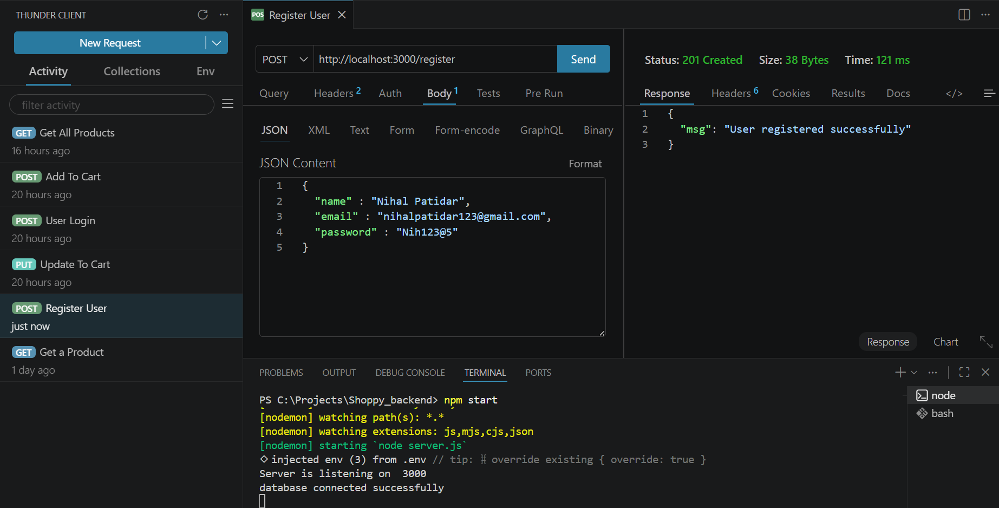

---

#### Email Validation
**API:** `POST /register`

Validates email format before creating a user account.

**Screenshot:** `screenshots/01-register-email-validation.png`

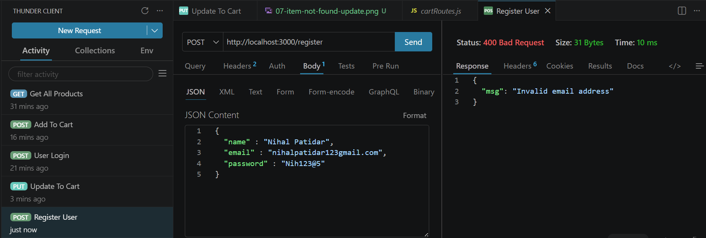

---

#### Password Validation
**API:** `POST /register`

Ensures password contains:
- Minimum 8 characters
- One uppercase letter
- One lowercase letter
- One number

**Screenshot:** `screenshots/01-password-validation.png`

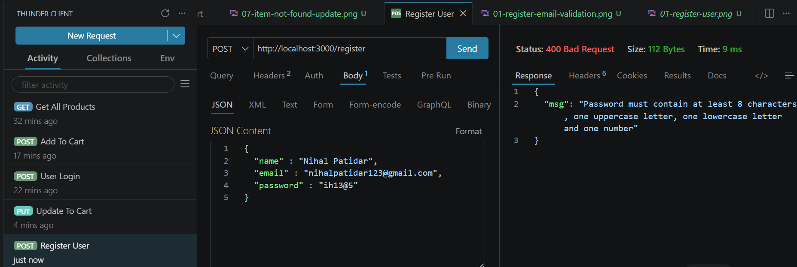

---

#### User Already Exists Validation
**API:** `POST /register`

Prevents duplicate user registration using the same email address.

**Screenshot:** `screenshots/01-user-already-exists.png`

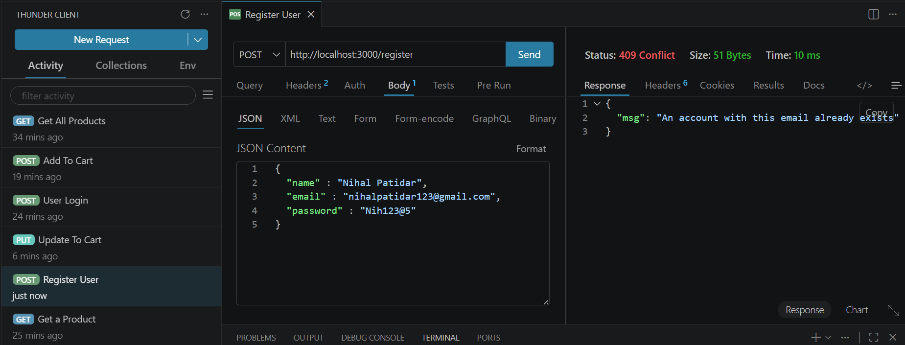

---

#### MongoDB User Collection
Displays newly registered user stored in MongoDB.

**Screenshot:** `screenshots/01-db-user-register.png`

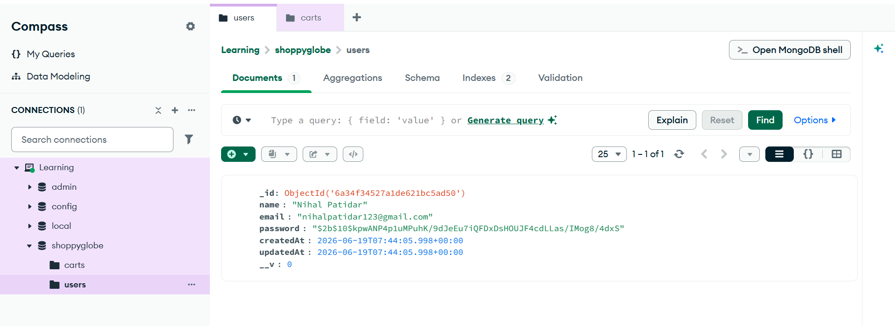

---

### 02. User Login

#### Login User
**API:** `POST /login`

Authenticates user credentials and generates a JWT authentication token.

**Screenshot:** `screenshots/02-login-user.png`

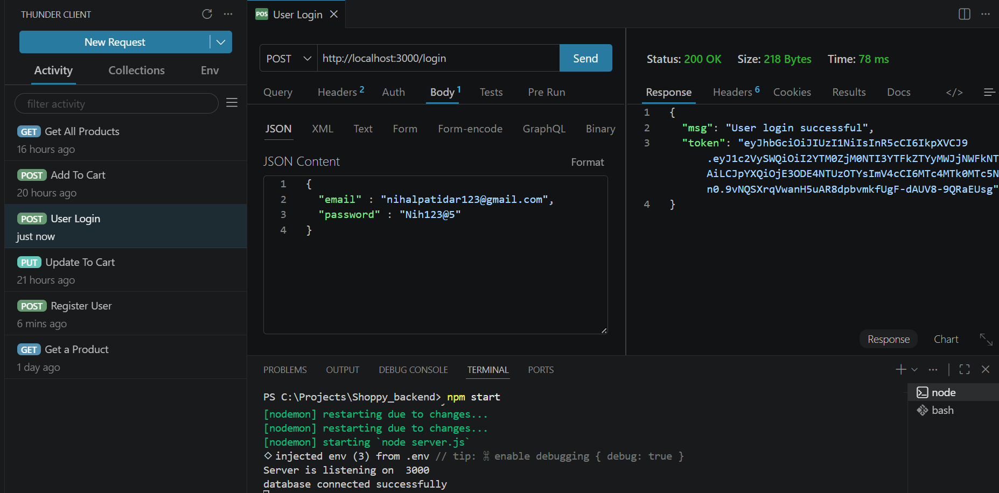

---

### 03. Product APIs

#### Seed Dummy Products
Populates the Products collection with sample product data.

**Screenshot:** `screenshots/03-seed-dummy-products.png`

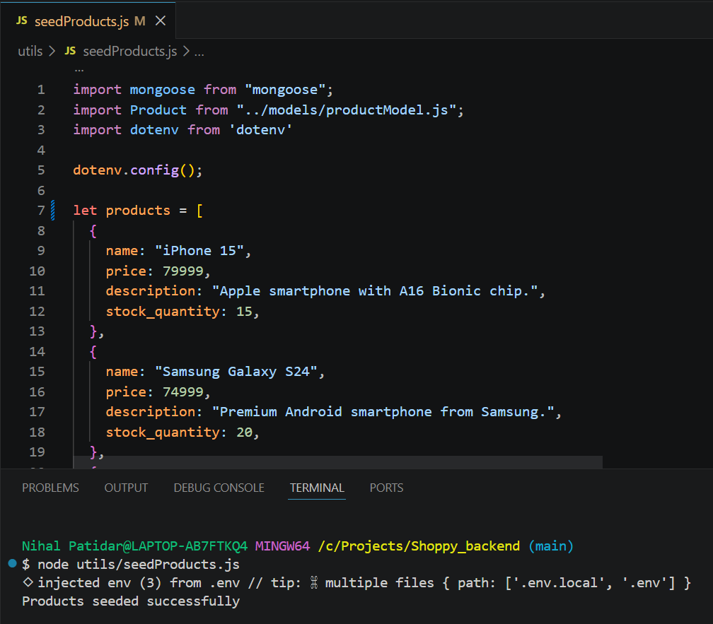

---

#### MongoDB Product Collection
Shows product documents stored in MongoDB.

**Screenshot:** `screenshots/03-db-seed-product.png`

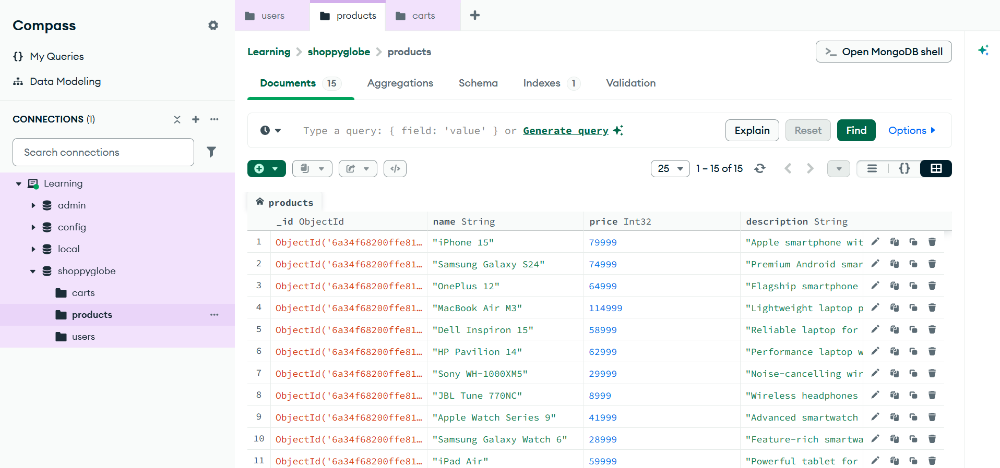

---

### 04. Get Product By ID

#### Fetch Single Product
**API:** `GET /products/:id`

Returns details of a specific product using its MongoDB ObjectId.

**Screenshot:** `screenshots/04-get-a-product.png`

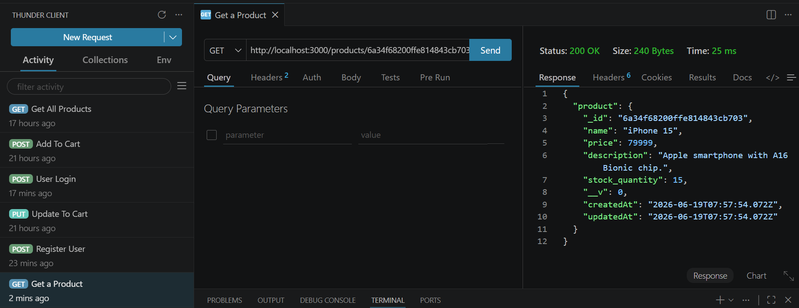

---

### 05. Get All Products

#### Fetch Product List
**API:** `GET /products`

Returns all available products from MongoDB.

**Screenshot:** `screenshots/05-get-all-product.png`

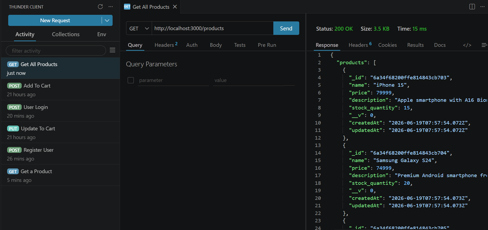

---

### 06. Add Product To Cart

#### Add To Cart
**API:** `POST /cart`

Adds a product to the authenticated user's shopping cart.

**Screenshot:** `screenshots/06-add-to-cart.png`

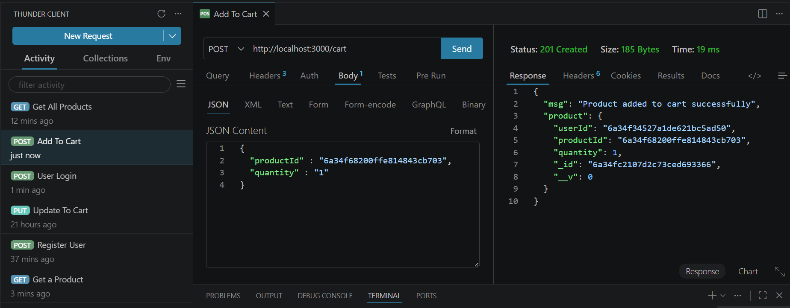

---

#### Protected Route Validation
**API:** `POST /cart`

Validates JWT token before allowing access to cart operations.

**Screenshot:** `screenshots/06-authentication-failed.png`

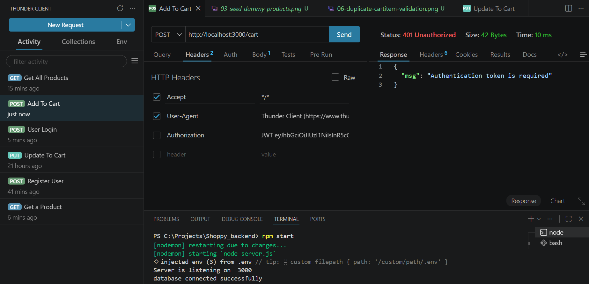

---

#### Duplicate Cart Item Validation
**API:** `POST /cart`

Prevents adding the same product multiple times to the user's cart.

**Screenshot:** `screenshots/06-duplicate-cartitem-validation.png`

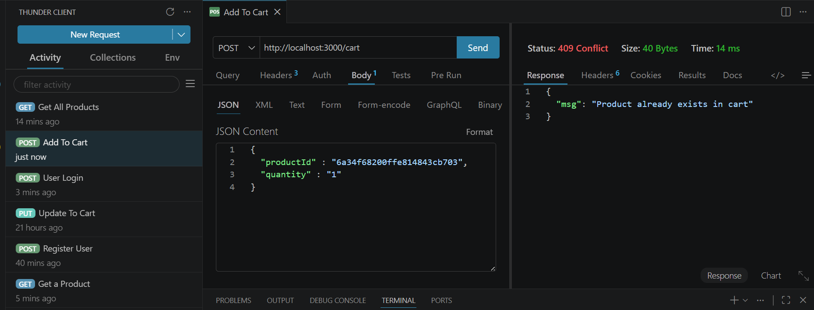

---

#### MongoDB Cart Collection
Displays cart item successfully stored in MongoDB.

**Screenshot:** `screenshots/06-db-add-to-cart.png`

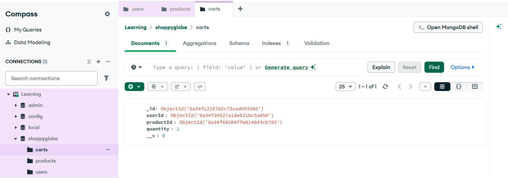

---

### 07. Update Cart

#### Update Cart Quantity
**API:** `PUT /cart/:productId`

Updates quantity of a product already present in the user's cart.

**Screenshot:** `screenshots/07-update-to-cart.png`

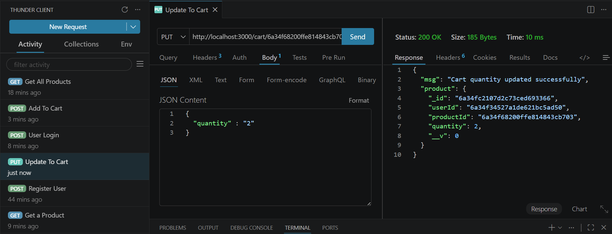

---

#### Protected Route Validation
**API:** `PUT /cart/:productId`

Verifies JWT authentication before allowing cart modification.

**Screenshot:** `screenshots/07-protected-update-cart-route.png`

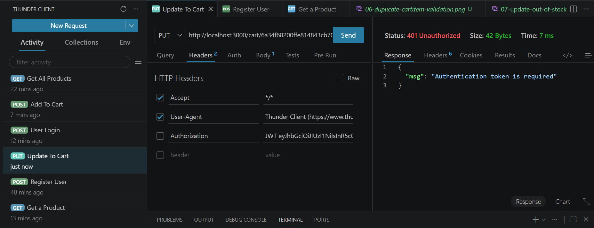

---

#### Stock Validation
**API:** `PUT /cart/:productId`

Prevents updating cart quantity beyond available product stock.

**Screenshot:** `screenshots/07-update-out-of-stock-validation.png`

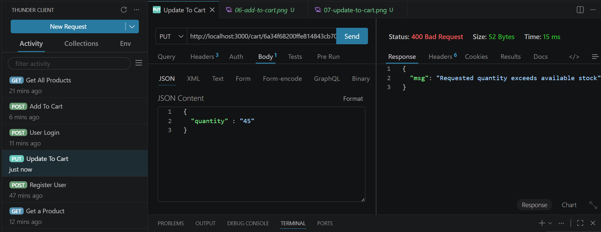

---

#### Cart Item Not Found
**API:** `PUT /cart/:productId`

Returns an error when attempting to update a non-existent cart item.

**Screenshot:** `screenshots/07-item-not-found-update.png`

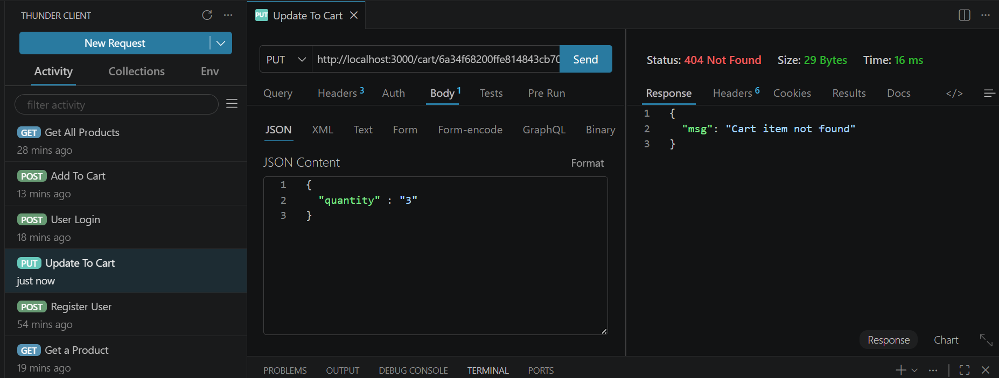

---

### 08. Delete Cart

#### Delete CartItem
**API:** `DELETE /cart/:productId`

Delete a product already present in the user's cart.

**Screenshot:** `screenshots/08-delete-from-cart.png`

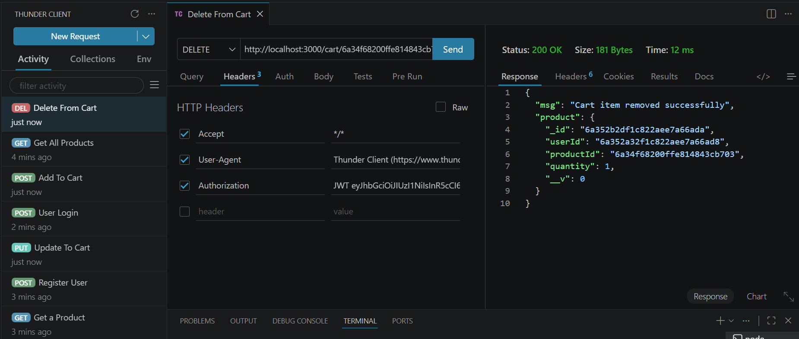

---

---

## Author

**Nihal Patidar**

Final Year B.Tech (Information Technology)  
Jabalpur Engineering College, Jabalpur

---

## GitHub Repository

https://github.com/nihal-patidar/ShoppyGlobe-E-commerce_backend